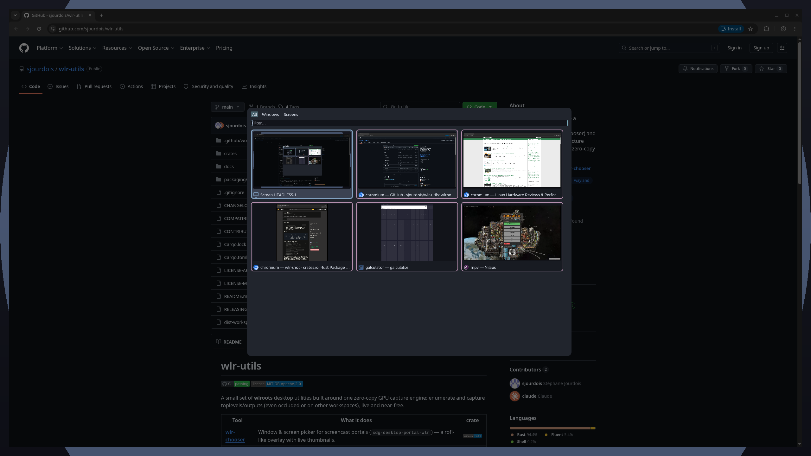
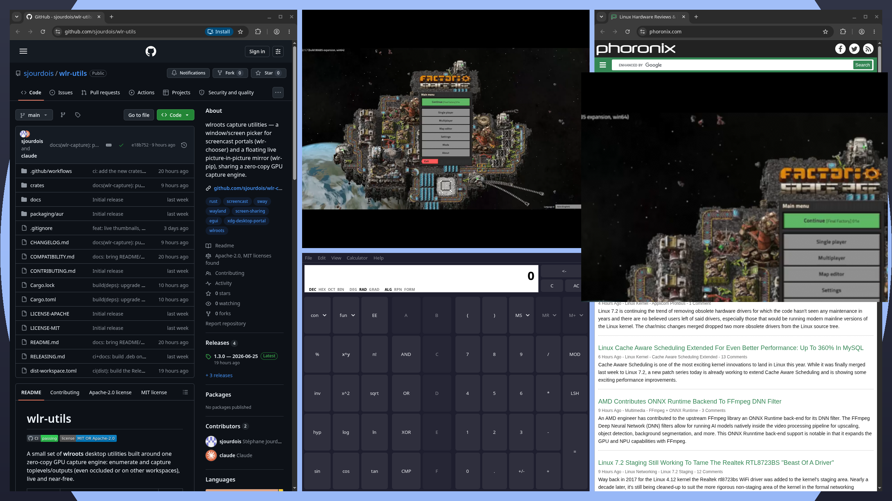

<style>
.chips{text-align:center;margin:1.6rem 0 .4rem;line-height:2.2}
.chips span{background:#eef2ff;color:#33417a;border:1px solid #d3ddf6;border-radius:999px;
  padding:6px 16px;margin:4px;font-size:.95rem;font-weight:600;white-space:nowrap}
.lead{text-align:center;font-size:1.35rem;font-weight:600;margin:.6rem 0 1.2rem}
</style>

<p class="chips">
<span>⚡ Zero-copy GPU capture</span>
<span>👁️ Sees occluded windows</span>
<span>🖥️ Across workspaces</span>
<span>🦀 Rust · native Wayland</span>
<span>🎨 Themeable</span>
<span>🌍 13 languages</span>
</p>

<p class="lead">Five sharp tools. One capture engine.<br>Pick · switch · capture · inspect · draw.</p>

<p style="text-align:center">
<a class="btn" href="https://github.com/sjourdois/wlr-utils">Source on GitHub</a>
&nbsp;
<a class="btn" href="https://github.com/sjourdois/wlr-utils/blob/main/COMPATIBILITY.md">Compatibility</a>
</p>

---

## wlr-draw — draw live on screen

**Scribble over anything.** Arrows, shapes, dwell-snap and text on a transparent
always-on-top overlay — plus a presenter **spotlight** to focus the room.

<video src="assets/wlr-draw/annotate.mp4" autoplay loop muted playsinline width="900"></video>

Presenter **spotlight** — hold Shift to dim everything but a flashlight that
follows the cursor, or pose a fixed spotlight on a window:

<video src="assets/wlr-draw/spotlight.mp4" autoplay loop muted playsinline width="900"></video>

```sh
wlr-draw            # start the daemon
wlr-draw toggle     # toggle draw mode (bind it to a hotkey)
```

---

## wlr-switcher — Alt-Tab & exposé with live previews

**Alt-Tab with live previews.** The exposé reveals windows from *other
workspaces* — even occluded ones. Real moving thumbnails, not icons.

<video src="assets/wlr-switcher/altab.mp4" autoplay loop muted playsinline width="49%"></video>
<video src="assets/wlr-switcher/expose.mp4" autoplay loop muted playsinline width="49%"></video>

```sh
# A true Alt-Tab: bind it to a held modifier.
bindsym Mod1+Tab exec wlr-switcher
```

---

## wlr-chooser — pick a window or screen

**Share the right window.** A rofi-like picker with live thumbnails for the
screencast portal — pick from previews, not a text list.



---

## wlr-shot — capture the screen

**Screenshot or record anything.** Region, window or whole output → PNG/JPEG, or
H.264 / GIF with **system audio** and **timelapse**. Below: the frozen region selector.

<video src="assets/wlr-shot/select.mp4" autoplay loop muted playsinline width="900"></video>

```sh
wlr-shot screenshot -s out.png        # drag a region on a frozen screen
wlr-shot record -o DP-1 --audio out.mp4
```

---

## wlr-peek — inspect the screen

**Inspect the screen.** Colour pipette, magnifier, live picture-in-picture
**mirror**, OCR, visual **grep** and a change **monitor** — in one tool.

<video src="assets/wlr-peek/color.mp4" autoplay loop muted playsinline width="49%"></video>
<video src="assets/wlr-peek/loupe.mp4" autoplay loop muted playsinline width="49%"></video>

The live **mirror** (picture-in-picture, zooming a region ×2), and the CLI
subcommands (`ocr`, `watch`, …) running against the screen:


<video src="assets/wlr-peek/cli.mp4" autoplay loop muted playsinline width="49%"></video>

```sh
wlr-peek color                          # pipette — pick a colour
wlr-peek loupe                          # magnifier — scroll to zoom
wlr-peek mirror -w ID                   # live picture-in-picture of a window
wlr-peek region                         # slurp replacement — print "X,Y WxH"
wlr-peek ocr -s                         # OCR a region you select
wlr-peek grep "feature"                 # visual grep — find on-screen text
wlr-peek watch -o DP-1 --on change      # fire when a region changes
```

---

## Install

All tools are published on [crates.io](https://crates.io/crates/wlr-capture):

```sh
cargo install wlr-chooser wlr-shot wlr-peek wlr-draw
```

They run on wlroots compositors that implement `ext-image-copy-capture-v1`
(**sway**, **Hyprland**, **niri**, …). See the
[compatibility matrix](https://github.com/sjourdois/wlr-utils/blob/main/COMPATIBILITY.md).

<p align="center"><sub>All media on this page is generated reproducibly by
<a href="https://github.com/sjourdois/wlr-utils/tree/main/tools/screenshots"><code>tools/screenshots</code></a>
in an isolated headless compositor.</sub></p>
