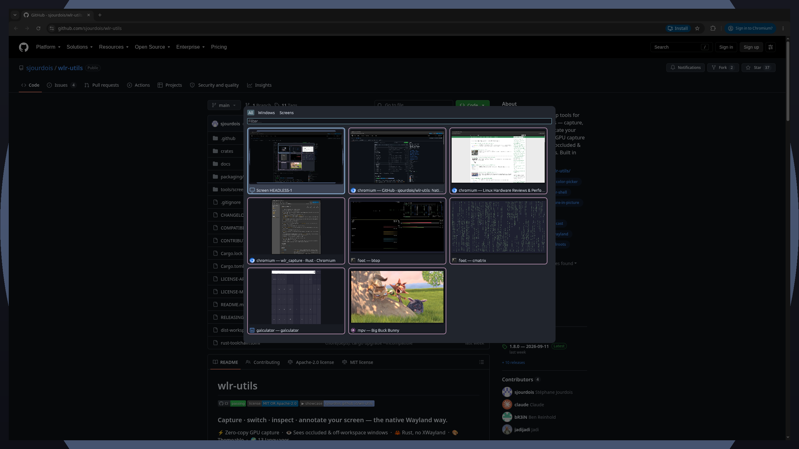
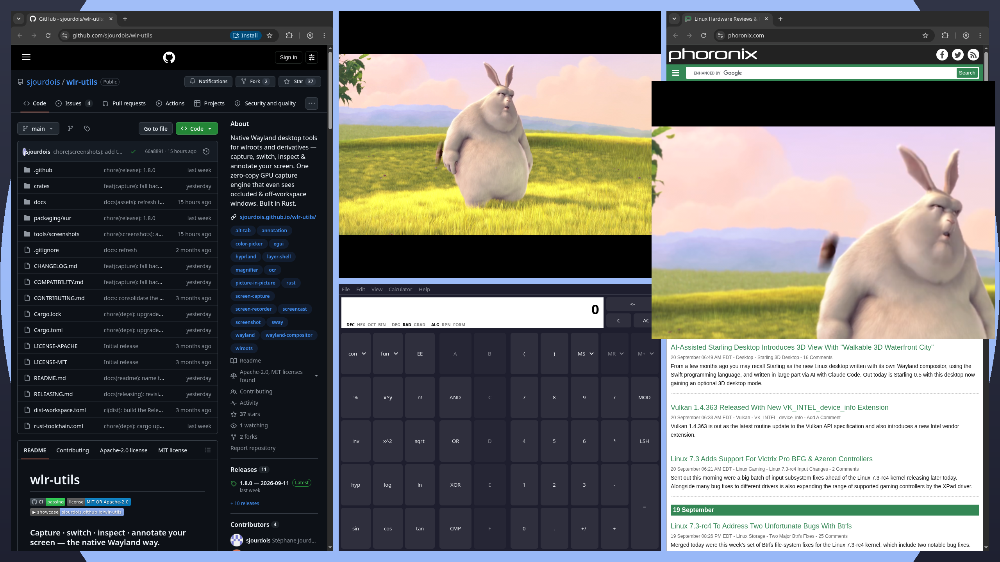

<style>
.chips{text-align:center;margin:1.6rem 0 .4rem;line-height:2.2}
.chips span{background:#eef2ff;color:#33417a;border:1px solid #d3ddf6;border-radius:999px;
  padding:6px 16px;margin:4px;font-size:.95rem;font-weight:600;white-space:nowrap}
.lead{text-align:center;font-size:1.35rem;font-weight:600;margin:.6rem 0 1.2rem}
</style>

<p class="chips">
<span>⚡ Zero-copy GPU capture</span>
<span>👁️ Sees occluded windows</span>
<span>🖥️ Across workspaces</span>
<span>🦀 Rust</span>
<span>🪟 Wayland-native</span>
<span>🎨 Themeable</span>
<span>🌍 13 languages</span>
</p>

<p class="lead">Five tools for wlroots and derivatives.<br>Pick · switch · capture · inspect · draw.</p>

<p style="text-align:center;max-width:660px;margin:0 auto 1.4rem;font-size:1.05rem;line-height:1.5">
<strong>Name a window — even one you can't see.</strong> Screenshot, record, mirror, OCR or
watch any window by app id or title, occluded behind others or parked on another
workspace. No clicking, no workspace-hopping — and it scripts.</p>

<p style="text-align:center">
<a class="btn" href="https://github.com/sjourdois/wlr-utils">Source on GitHub</a>
&nbsp;
<a class="btn" href="https://github.com/sjourdois/wlr-utils/blob/main/COMPATIBILITY.md">Compatibility</a>
</p>

---

## wlr-chooser — pick a window or screen

**Share the right window.** A rofi-like picker with live thumbnails for the
screencast portal — pick from live previews, not a text list. It also answers to
scripts: `--layout grid --hints` for one keystroke per window, `--format json` for
the app id, title and pid of what you picked.



---

## wlr-switcher — Alt-Tab & exposé with live previews

**Alt-Tab with live previews.** The exposé reveals windows from *other
workspaces* — even occluded ones. Real moving thumbnails, not icons.

<video src="assets/wlr-switcher/altab.mp4" autoplay loop muted playsinline width="49%"></video>
<video src="assets/wlr-switcher/expose.mp4" autoplay loop muted playsinline width="49%"></video>

Press a letter to jump straight to a window: the label is whatever your keyboard
layout prints on that key, so it names the key under your finger — `a` on QWERTY,
`q` on AZERTY, same position. Narrow the list first with `--app-id`, `--title`,
`--pid` or, on sway, `--scratchpad`; the windows left out are never captured, and
with hold-to-switch a lone window left is switched to at once.

```sh
# A true Alt-Tab: bind it to a held modifier.
bindsym Mod1+Tab exec wlr-switcher
bindsym Mod1+grave exec wlr-switcher --layout grid --hints --app-id foot
# sway's scratchpad: one key fetches a window, and puts it back.
bindsym $mod+minus exec wlr-switcher --scratchpad toggle --cycle-key Minus:Equal
```

Start `wlr-overlayd` with your session — `exec wlr-overlayd` — and the overlay
appears in about ten milliseconds instead of ninety: the daemon holds the GPU
context both it and `wlr-chooser` would otherwise rebuild every time. Nothing is
captured while it waits, and neither tool needs a daemon to work.

---

## wlr-shot — capture the screen

**Screenshot or record anything.** Region, window or whole output → PNG/JPEG,
or H.264 / GIF — with **system audio** and **timelapse**.

Target a window **by name** (`--app-id`/`--title`) — even hidden, on another
workspace, or behind a lock screen. It grabs the window itself, not the visible
pixels, so there's no need to raise it first.

Whole-screen grabbers like `grim` shoot the visible output — so they miss what
isn't on it: occluded or unmapped windows, overlays, other workspaces.

Below: the frozen region selector.

<video src="assets/wlr-shot/select.mp4" autoplay loop muted playsinline width="900"></video>

```sh
wlr-shot screenshot -s out.png            # drag a region on a frozen screen
wlr-shot screenshot --app-id firefox out.png   # a window by name — even hidden or locked
wlr-shot record -o DP-1 out.mp4                # video + system audio
wlr-shot record -o DP-1 --crf 18 --cursor out.mp4   # finer encoding, pointer included
```

---

## wlr-draw — draw live on screen

**Scribble over anything.** Arrows, shapes, dwell-snap and text on a transparent
always-on-top overlay — plus a presenter **spotlight** to focus the room. Hold a
freehand stroke still and it snaps to a clean line or ellipse; tune that delay in
`keys.toml`, switch it off with a key, or hold Alt to invert it for one stroke.

<video src="assets/wlr-draw/annotate.mp4" autoplay loop muted playsinline width="900"></video>

Presenter **spotlight** — hold Shift to dim everything but a flashlight that
follows the cursor, or pose a fixed spotlight on a window:

<video src="assets/wlr-draw/spotlight.mp4" autoplay loop muted playsinline width="900"></video>

```sh
wlr-draw            # start the daemon
wlr-draw toggle     # toggle draw mode (bind it to a hotkey)
```

---

## wlr-peek — inspect the screen

**Inspect the screen.** Colour pipette, magnifier, live picture-in-picture
**mirror**, OCR, visual **grep**, a change **monitor** — one tool.

`mirror`, `ocr` and `watch` take `--app-id`/`--title`, so they reach a window
even when it's occluded or off-workspace.

<video src="assets/wlr-peek/color.mp4" autoplay loop muted playsinline width="49%"></video>
<video src="assets/wlr-peek/loupe.mp4" autoplay loop muted playsinline width="49%"></video>

The live **mirror** (picture-in-picture, zooming a region ×2), and the CLI
subcommands (`ocr`, `watch`, …) running against the screen:


<video src="assets/wlr-peek/cli.mp4" autoplay loop muted playsinline width="49%"></video>

```sh
wlr-peek color                          # pipette — pick a colour
wlr-peek loupe                          # magnifier — scroll to zoom
wlr-peek mirror --app-id firefox        # live PiP of a window by name — even off-workspace
wlr-peek region                         # slurp replacement — print "X,Y WxH"
wlr-peek ocr --app-id thunderbird       # read a window's text without raising it
wlr-peek grep "feature"                 # visual grep — find on-screen text
wlr-peek watch -o DP-1 --on change      # fire when a region changes
```

---

## Install

All five tools in one go — the `wlr-utils` bundle:

```sh
cargo install wlr-utils
```

…or grab the [prebuilt bundle](https://github.com/sjourdois/wlr-utils/releases/latest)
(one archive + a one-line `wlr-utils-installer.sh`). Prefer a single tool? Install it on
its own — `cargo install wlr-shot` (also `wlr-chooser`, `wlr-peek`, `wlr-draw`). Uninstall
with `cargo uninstall <name>`; see the
[main README](https://github.com/sjourdois/wlr-utils#uninstall) for the leftover files
`wlr-draw` writes (its autostart entry).

They run on wlroots compositors that implement `ext-image-copy-capture-v1`
(**sway**, **Hyprland**, **cosmic-comp**, …), and on the screen features alone where
only `wlr-screencopy` is exposed (**niri**, and **dwl** before 0.9). See the
[compatibility matrix](https://github.com/sjourdois/wlr-utils/blob/main/COMPATIBILITY.md).

<p align="center"><sub>All media on this page is generated reproducibly by
<a href="https://github.com/sjourdois/wlr-utils/tree/main/tools/screenshots"><code>tools/screenshots</code></a>
in an isolated headless compositor.</sub></p>
